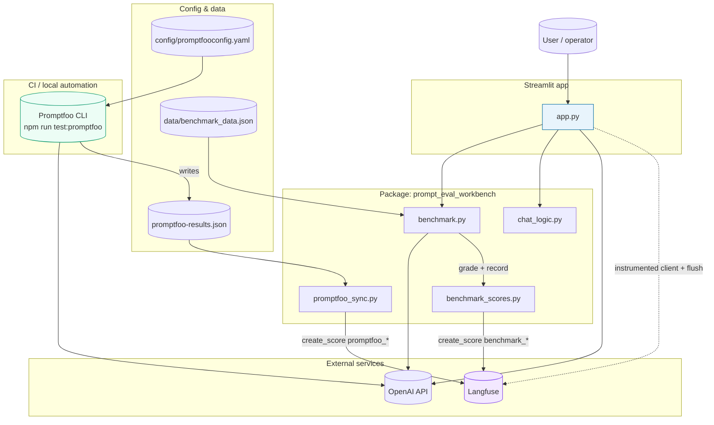

# Architecture

This document is a **single end-to-end view** of the workbench: how the Streamlit app, the Python package, OpenAI, Langfuse, and the Promptfoo automation path connect. It matches the implementation under `app.py`, `prompt_eval_workbench/`, `data/`, and `config/`.

## System diagram

**Reading the diagram**

- **Solid lines** are primary data or control: HTTP to OpenAI, file reads, score uploads.
- **Dotted** from `app.py` to Langfuse indicates **tracing and generations** (via the Langfuse-wrapped client), not a separate file artifact.
- **Two score families** land in Langfuse: `benchmark_*` from the in-app benchmark (`benchmark_scores.py`), and `promptfoo_*` from `promptfoo_sync.py` after a Promptfoo run.

For a stakeholder-oriented narrative (including problem framing and best practices), see the static deck at [`presentation/index.html`](presentation/index.html).
